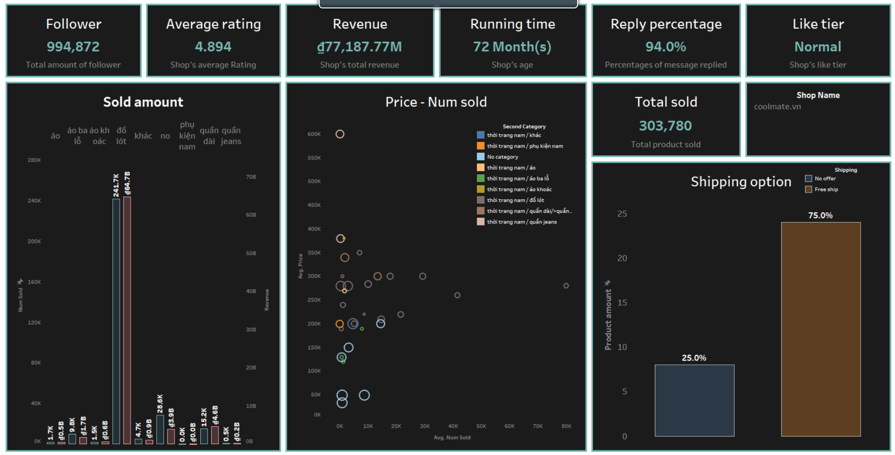

# E-Commerce Support System

## Description

It can be hard to know how much something’s really worth. Small details can mean big
differences in pricing. 

Product pricing gets even harder at scale, considering just how many products are sold
online. Clothing has strong seasonal pricing trends and is heavily influenced by brand
names, while electronics have fluctuating prices based on product specs.

We’d like to offer a solution to this problem by creating a system capable of giving
pricing suggestions to sellers. Shop owners provide information about the product
that they intend to sell, and our system will predict the optimal price for that particular
product. In addition, we’d like to provide sellers with various visualizations and reports to aid them with the process of choosing the appropriate price for their products.

The data are obtained through e-commerce websites (Lazada and Shopee), which are then used to perform price analysis and train price-prediction models.

## Architecture

  

### Ingestion overview

  

There are 2 kinds of the scraper:
- URL scraper: goes through each categories' web page and extracts the product page URL, which will be used by the second scraper: info scraper
- Info scraper: given a product page URL, extracts various product information

URL scraper will publish the urls to their respective url topics, which is consumed by a number of info scrapers. Then, these scrapers will get the product info from the url and publish them to the info topics. Lastly, the raw data will be consumed into HDFS for storage.

### Data pipelines
#### [Ingestion](dags/data_crawling.py)

  

#### [Processing](dags/data_processing.py)

  

## Dashboard

  

## Dependencies
- chrome 110.0.5481.77
- hadoop 3.3.4
- spark 3.3.1
- confluent 2.28.1
- python packages: `pip install -r requirements.txt`
